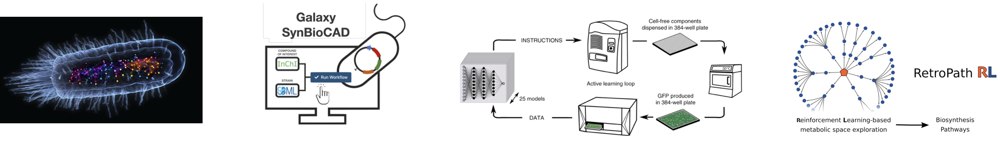

## Bio-RetroSynth group

Our group is interested in synthetic biology in whole-cell and cell-free systems.  We develop computational and wet lab protocols to search, design, and engineer biological pathways and networks. Other activities include structure-activity, sequence-function relationships, retrosynthesis, and the design of experiments using active and reinforcement machine learning methods. The applications of our work include synthetic metabolic pathways and genetic circuits engineering for bioproduction, biosensing, and biocomputing.

